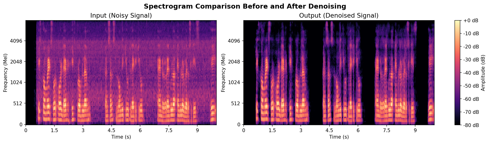
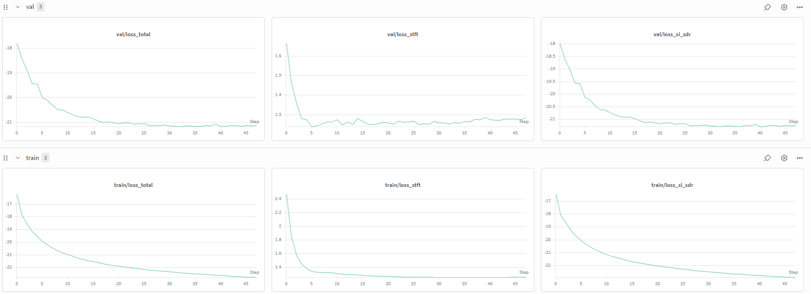
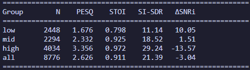
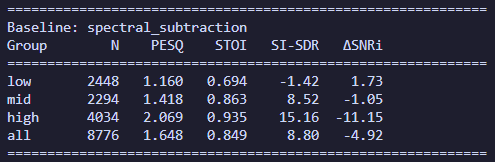
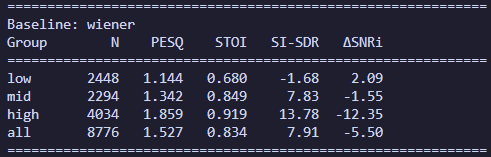

# Speech Denoising with a U-Net + BiLSTM Mask Estimator

Deep learning system for single-channel speech enhancement (noise removal from speech recordings). A U-Net convolutional encoder–decoder with a bidirectional LSTM bottleneck and lightweight spectral attention predicts a time–frequency soft mask that is applied to the noisy magnitude spectrogram to recover clean speech. The project also includes classical DSP baselines (spectral subtraction, Wiener filtering) and a full evaluation suite (PESQ, STOI, SI-SDR, SNR improvement) for comparison.



---

## Table of Contents

- [Overview](#overview)
- [Pipeline at a Glance](#pipeline-at-a-glance)
- [Repository Structure](#repository-structure)
- [Installation](#installation)
- [Dataset](#dataset)
- [Signal Processing](#signal-processing)
- [Model Architecture](#model-architecture)
- [Preprocessing](#preprocessing)
- [Training](#training)
- [Loss Function](#loss-function)
- [Evaluation & Metrics](#evaluation--metrics)
- [Classical Baselines](#classical-baselines)
- [Inference](#inference)
- [Configuration Reference](#configuration-reference)
- [Notes & Limitations](#notes--limitations)
- [References](#references)

---

## Overview

Given a noisy speech recording, the model estimates a soft gain mask `M ∈ [0, 1]` per time–frequency bin such that:

```
clean_magnitude_estimate ≈ M ⊙ noisy_magnitude
```

The masked magnitude is recombined with the **original noisy phase** and converted back to a waveform via inverse STFT. This is the standard "masking-based" approach to single-channel speech enhancement — the network never has to reconstruct phase, only decide how much of each spectral component to keep.

**Highlights**

- U-Net encoder/decoder operating on log-magnitude spectrograms, with skip connections for detail preservation
- BiLSTM bottleneck for long-range temporal context, followed by channel + frequency (SE-Net style) attention
- Combined loss: negative SI-SDR (waveform-domain) + multi-resolution STFT loss (spectral-domain)
- Full metric suite: PESQ, STOI, SI-SDR, ΔSNRi, broken down by input SNR difficulty (low/mid/high)
- Classical DSP baselines (spectral subtraction, Wiener filter) for an apples-to-apples comparison
- Trained/evaluated on the Microsoft **DNS Challenge (v5)** dataset, with helper scripts to download it
- Fast training via an offline preprocessing step that caches spectrograms as `.pt` tensors

---

## Pipeline at a Glance

```
                     ┌─────────────────────────────────────────────────────────┐
                     │                    OFFLINE (once)                       │
                     │  clean speech + noise  →  mix at random SNR (+ optional │
                     │  room impulse response) → 2s segments (50% overlap) →   │
                     │  STFT → log-compress → z-score normalise → save .pt     │
                     └─────────────────────────────────────────────────────────┘
                                              │
                                              ▼
   ┌────────────┐   noisy spec   ┌───────────────────────────┐   soft mask   ┌──────────────┐
   │  .pt file  │ ─────────────► │ U-Net encoder → BiLSTM →  │ ────────────► │ mask × noisy │
   │ (train/val/│                │ attention → U-Net decoder │               │  magnitude   │
   │   test)    │                └───────────────────────────┘               └──────┬───────┘
   └────────────┘                                                                   │
                                                                                    ▼
                                                                          iSTFT (noisy phase) → waveform
                                                                                        │
                                                                                        ▼
                                                                     loss = −SI-SDR + 0.1 · multi-res STFT loss
```

At inference time the same STFT → mask → iSTFT pipeline runs on a single arbitrary-length WAV file, using overlap-add across 2‑second segments, followed by an optional bandpass + loudness-matching post-filter.

---

## Repository Structure

```
audio-denoising/
├── requirements.txt                 # Python dependencies (PyTorch installed separately)
├── download-dns-minimal.sh          # Downloads a minimal slice of DNS5 training data (clean+noise+IR)
├── download-dns5-dev-testset.sh     # Downloads the official DNS5 dev testset (noisy/clean pairs)
├── src/
│   ├── config.py                    # All paths, hyperparameters, audio settings (single source of truth)
│   ├── utils.py                     # WAV I/O, STFT/iSTFT, log-compression, normalisation helpers
│   ├── dataset.py                   # PyTorch Dataset, segmentation, speaker-stratified splitting
│   ├── preprocess.py                # Offline: synthesize noisy/clean pairs → cached .pt segments
│   ├── model.py                     # UNetDenoiser: encoder / BiLSTM bottleneck / attention / decoder
│   ├── losses.py                    # SI-SDR loss + multi-resolution STFT loss
│   ├── train.py                     # Training loop, LR schedule, checkpointing, early stopping, W&B
│   ├── evaluate.py                  # PESQ / STOI / SI-SDR / ΔSNRi evaluation on the test split
│   ├── baseline.py                  # Spectral subtraction & Wiener filter baselines (same metrics)
│   └── inference.py                 # Denoise a single WAV or a random batch, saves spectrogram PNGs
├── data/                            # (created locally) raw + preprocessed audio
├── checkpoints/                     # (created locally) saved model weights
└── outputs/                         # (created locally) denoised WAVs + spectrogram comparison PNGs
```

---

## Installation

```bash
# 1. Install PyTorch/torchaudio matching your CUDA version FIRST
pip install torch torchaudio --index-url https://download.pytorch.org/whl/cu121   # CUDA 12.1
# or cu118 / cu124 — see requirements.txt header for the exact commands

# 2. Install the rest of the dependencies
pip install -r requirements.txt
```

Core dependencies: `torch`, `soundfile`, `scipy`, `librosa` (audio I/O, resampling, mel display), `pesq` and `pystoi` (perceptual metrics), `numpy`, `matplotlib`, `wandb` (optional experiment tracking).

---

## Dataset

The project targets the **Microsoft DNS Challenge v5** dataset (fullband clean speech + noise + room impulse responses, plus an official noisy/clean dev testset used for evaluation).

Two helper scripts are provided:

| Script                         | Purpose                                                                                                                                                                               | Approx. size |
| ------------------------------ | ------------------------------------------------------------------------------------------------------------------------------------------------------------------------------------- | ------------ |
| `download-dns-minimal.sh`      | Downloads a minimal slice of **training** data: Russian speech + VocalSet clean speech, Freesound noise, and impulse responses. Used by `preprocess.py` to synthesize training pairs. | ~23 GB       |
| `download-dns5-dev-testset.sh` | Downloads the official **dev testset** — pre-mixed noisy/clean WAV pairs used directly for evaluation, no synthesis needed.                                                           | ~4 GB        |

Expected layout after download (matches the defaults in `config.py`):

```
data/
├── raw/
│   ├── clean_fullband/mnt/dnsv5/clean/     # clean speech WAVs (training)
│   └── noise_fullband/                     # background noise WAVs (training)
└── processed/
    ├── noisy_testclips/                    # DNS dev testset - noisy WAVs
    └── clean_testclips/                    # DNS dev testset - matching clean WAVs
```

> You can point to any dataset with the same structure — the pipeline only requires directories of mono/stereo WAV files for clean speech, noise, and (optionally) room impulse responses. All paths are overridable via CLI flags or by editing `config.py`.

---

## Signal Processing

All spectral processing is centralized in `utils.py` and shared identically across preprocessing, training, evaluation, and inference — so there is no train/inference mismatch.

**1. Loading & resampling** — WAVs are loaded, mixed down to mono if needed, and resampled to **16 kHz** (`resample_poly`) if the source rate differs.

**2. STFT** — Short-Time Fourier Transform with a Hann window:

| Parameter          | Value                 |
| ------------------ | --------------------- |
| Sample rate        | 16,000 Hz             |
| FFT size (`N_FFT`) | 512                   |
| Hop length         | 128 (25% of FFT size) |
| Window length      | 512 (Hann window)     |
| Frequency bins     | 257 (`N_FFT/2 + 1`)   |

The complex STFT is split into **magnitude** (fed to the model) and **phase** (kept untouched and reused at reconstruction time — the model never has to predict phase).

**3. Log-compression** — `log1p(magnitude)` compresses the large dynamic range of speech so that quiet phonetic detail isn't dominated by loud components.

**4. Z-score normalisation** — the log-magnitude is normalised to zero mean / unit variance. Critically, the **mean/std are computed on the noisy spectrogram and reused for the paired clean spectrogram**, so both are on a consistent scale and the exact transform can be inverted later (mean/std are saved alongside every segment).

**5. Masking** — the model outputs a mask `M ∈ [0, 1]` (sigmoid-activated) over the _normalised_ time–frequency grid. At apply-time the mask is used as a gain on the **raw (de-normalised, de-compressed) magnitude**, not the normalised one:

```
raw_magnitude   = expm1(denormalise(noisy_log_spec))
clean_magnitude = mask * raw_magnitude
```

**6. Reconstruction (iSTFT)** — the masked magnitude is recombined with the original noisy phase (`z = |z| · e^(iθ)`) and inverted back to a waveform with `torch.istft`, using the same Hann window/hop/FFT settings.

**7. Segmentation** — long recordings are cut into **2-second** segments with **50% overlap** (`SEGMENT_DURATION`, `OVERLAP` in `config.py`). Trailing segments with less than 25% real content are dropped rather than zero-padded to avoid training on mostly-silence. At inference time, segments are stitched back together with overlap-add and trimmed to the original length.

**8. Noisy/clean mixing (data synthesis, training only)** — clean speech and noise are mixed at a target SNR drawn uniformly from **[-5 dB, 30 dB]**:

```
noise_scaled = noise * sqrt( (clean_power / 10^(SNR/10)) / noise_power )
noisy        = clean + noise_scaled
```

Optionally, a random **room impulse response** is convolved with the clean signal first (FFT-based convolution) to simulate reverberant recording conditions before mixing in noise.

**9. Post-processing (inference only, not used during evaluation)** — a 2nd-order Butterworth bandpass filter (80–7500 Hz, zero-phase `filtfilt`) trims out-of-band artifacts, followed by peak-loudness matching to the original input level.

---

## Model Architecture

`UNetDenoiser` (in `model.py`) takes a `(batch, 1, 257, T)` log-magnitude spectrogram and outputs a same-shaped mask in `[0, 1]`.

| Stage                   | Description                                                                                                                                                                                                                                                                                |
| ----------------------- | ------------------------------------------------------------------------------------------------------------------------------------------------------------------------------------------------------------------------------------------------------------------------------------------ |
| **Encoder**             | 5 stride-2 conv blocks (`Conv2d → BatchNorm → LeakyReLU`), channels `[32, 64, 128, 256, 512]` by default. Each block halves both frequency and time resolution while doubling channel depth. Feature maps are cached for skip connections.                                                 |
| **Bottleneck (BiLSTM)** | The compressed `(C, F, T)` feature map is reshaped so time is the sequence axis; a **2-layer bidirectional LSTM** (512 hidden units/direction) models long-range temporal dependencies that convolutions alone would miss, then a linear layer projects back to the original feature size. |
| **Spectral Attention**  | Lightweight SE-Net-style **channel attention** (which feature maps matter) and a **frequency attention** gate (which frequency bands matter), both sigmoid-gated, applied right after the BiLSTM. Lets the model suppress noise-dominated bands before decoding.                           |
| **Decoder**             | 5 stride-2 transpose-conv blocks (`ConvTranspose2d → BatchNorm → ReLU`), mirroring the encoder in reverse, each concatenating the matching encoder skip connection before upsampling.                                                                                                      |
| **Output head**         | Final transpose-conv + **sigmoid** producing the mask; a safety bilinear resize guarantees the mask exactly matches the input's spatial dimensions (handles off-by-one rounding from strided convs).                                                                                       |

Default configuration (`config.py`): encoder channels `[32, 64, 128, 256, 512]`, BiLSTM hidden size `512`, 2 LSTM layers. Model size is printed at the start of every training run.

You can sanity-check the architecture and print parameter count directly:

```bash
python src/model.py
```

---

## Preprocessing

Run once before training. It synthesizes noisy/clean pairs from raw clean speech + noise (+ optional impulse responses), segments them, computes spectrograms, and caches everything as `.pt` files so training never touches raw audio or does STFTs on the fly.

```bash
# Full run using default paths from config.py
python src/preprocess.py

# Custom paths
python src/preprocess.py --clean_dir path/to/clean --noise_dir path/to/noise --ir_dir path/to/ir

# Quick smoke test on a subset
python src/preprocess.py --limit 500

# Also split the cached segments into train/val/test subfolders
python src/preprocess.py --split
```

Each cached `.pt` file stores: `noisy_spec`, `clean_spec` (both log-compressed & normalised), `noisy_phase`, `clean_phase`, the normalisation `mean`/`std`, the mixing `snr_db`, and the source `clean_path` (for debugging).

`--split` performs a random file-level split (80/10/10 by default, `TRAIN_RATIO`/`VAL_RATIO`/`TEST_RATIO` in `config.py`) into `train/`, `val/`, `test/` subfolders. For a proper **speaker-stratified** split (no speaker leaking across splits) use `dataset.py`'s `build_dataloaders()` / `split_by_speaker()` instead, which groups by the speaker ID embedded in DNS filenames.

---

## Training

```bash
python src/train.py
```

What happens each epoch:

1. Load a batch of cached `(noisy_spec, clean_spec)` pairs from `PreprocessedDataset`
2. Forward pass: U-Net predicts a mask from the noisy spectrogram
3. The mask is applied to the **raw noisy magnitude**, then inverted to a waveform via iSTFT (same for the clean target, using its own phase) — loss is computed **in the waveform domain**, keeping train/inference consistent
4. Backprop with gradient clipping (`max_norm=5.0`, important given the LSTM)
5. Validate on the held-out validation split, track SI-SDR
6. Save a checkpoint whenever validation SI-SDR improves
7. Early-stop if validation SI-SDR hasn't improved for `EARLY_STOP_PATIENCE` epochs

**Optimisation setup**

| Setting                 | Value                                                                              |
| ----------------------- | ---------------------------------------------------------------------------------- |
| Optimiser               | AdamW                                                                              |
| Learning rate           | 1e-3 (peak)                                                                        |
| Weight decay            | 1e-4                                                                               |
| LR schedule             | Linear warmup (3 epochs) → cosine decay to `MIN_LR = 1e-5`                         |
| Batch size              | 32                                                                                 |
| Max epochs              | 100                                                                                |
| Early stopping patience | 15 epochs (on val SI-SDR)                                                          |
| Gradient clipping       | max-norm 5.0                                                                       |
| SNR augmentation        | random ±3 dB shift applied to the noise component each epoch (training split only) |

Training progress (loss components + LR) is logged to **Weights & Biases** automatically if `wandb` is installed and `WANDB_PROJECT` is set in `config.py` (set it to `None` to disable). Best checkpoints are written to `checkpoints/best_model.pt`.



---

## Loss Function

```
L = −SI-SDR(waveform) + 0.1 × MultiResolutionSTFTLoss(waveform)
```

- **SI-SDR (Scale-Invariant SDR)** — computed on zero-meaned waveforms; measures fidelity independent of absolute loudness. Since higher SI-SDR is better, the loss minimises its negative.
- **Multi-Resolution STFT Loss** — averaged over three STFT resolutions (`(256,64,256)`, `(512,128,512)`, `(1024,256,1024)`), each combining:
  - _Spectral convergence_: Frobenius-norm ratio between predicted and target magnitude, emphasizing high-energy regions
  - _Log-magnitude L1_: emphasizes quiet/fine spectral detail

  Using multiple resolutions forces the model to be accurate for both fast transients (small FFT) and stable tonal/phonetic structure (large FFT).

The `0.1` weight (`STFT_LOSS_WEIGHT` in `config.py`) keeps both loss terms in a comparable numeric range so neither dominates gradients.

---

## Evaluation & Metrics

```bash
python src/evaluate.py --checkpoint checkpoints/best_model.pt
```

Runs the model over every cached test segment, reconstructs noisy/clean/denoised waveforms, and reports:

| Metric              | Meaning                                                                                           | Range                         |
| ------------------- | ------------------------------------------------------------------------------------------------- | ----------------------------- |
| **PESQ** (wideband) | Perceptual Evaluation of Speech Quality — ITU-T standard, correlates with human quality judgments | −0.5 to 4.5 (higher = better) |
| **STOI**            | Short-Time Objective Intelligibility — correlates with how understandable speech is               | 0 to 1 (higher = better)      |
| **SI-SDR**          | Scale-Invariant Signal-to-Distortion Ratio (dB), loudness-independent fidelity                    | unbounded, higher = better    |
| **ΔSNRi**           | SNR improvement: `SNR_after − SNR_before` (dB)                                                    | unbounded, higher = better    |

Results are broken down by **input SNR difficulty group** so you can see where the model struggles:

| Group  | Input SNR                     |
| ------ | ----------------------------- |
| `low`  | < 5 dB (hard, heavily noisy)  |
| `mid`  | 5–15 dB                       |
| `high` | ≥ 15 dB (easy, lightly noisy) |
| `all`  | full test set                 |

Output looks like:



---

## Classical Baselines

For a non-ML reference point, `baseline.py` implements two traditional DSP denoisers and evaluates them with the **exact same metric pipeline** as the trained model, on the same test segments:

- **Spectral Subtraction** — estimates the noise power spectrum from the first few frames (assumed noise-only), subtracts it from every frame, with a spectral floor to avoid negative energy. Fast, but prone to "musical noise" artifacts and assumes stationary noise.
- **Wiener Filter** — per-bin gain `H(f) = SNR(f) / (1 + SNR(f))`, derived from an MMSE-optimal linear filter. Smoother than spectral subtraction but still assumes stationary, Gaussian-like noise.

```bash
python src/baseline.py
```

Use these numbers as a sanity floor — the trained model should meaningfully outperform both, especially on non-stationary noise types that violate the baselines' stationarity assumption.




---

## Inference

Denoise a single file:

```bash
python src/inference.py --input path/to/noisy.wav --output path/to/clean.wav
# or, to auto-save under outputs/<same filename>:
python src/inference.py --input path/to/noisy.wav
```

Batch mode — denoise N random files sampled from the dev testset:

```bash
python src/inference.py --batch 20
```

Each run:

1. Loads the best (or specified) checkpoint
2. Runs the STFT → mask → iSTFT pipeline with overlap-add across segments
3. Applies the post-processing bandpass + loudness-matching filter
4. Saves the denoised WAV to `outputs/`
5. Saves a **side-by-side mel-spectrogram comparison PNG** (`<output>_spectrogram.png`) automatically — no extra step needed, this is generated for every processed file

---

## Configuration Reference

All tunables live in `src/config.py`. The most relevant ones:

| Category     | Key                                        | Default                      | Notes                               |
| ------------ | ------------------------------------------ | ---------------------------- | ----------------------------------- |
| Audio        | `SAMPLE_RATE`                              | 16000                        | Hz                                  |
| Audio        | `N_FFT` / `HOP_LENGTH` / `WIN_LENGTH`      | 512 / 128 / 512              | STFT settings                       |
| Segmentation | `SEGMENT_DURATION` / `OVERLAP`             | 2.0s / 0.5                   | Training segment length & overlap   |
| Split        | `TRAIN_RATIO` / `VAL_RATIO` / `TEST_RATIO` | 0.8 / 0.1 / 0.1              | By speaker where applicable         |
| Model        | `ENCODER_CHANNELS`                         | `[32,64,128,256,512]`        | U-Net channel widths                |
| Model        | `LSTM_HIDDEN` / `LSTM_LAYERS`              | 512 / 2                      | BiLSTM bottleneck                   |
| Training     | `BATCH_SIZE` / `MAX_EPOCHS`                | 32 / 100                     |                                     |
| Training     | `LEARNING_RATE` / `WEIGHT_DECAY`           | 1e-3 / 1e-4                  | AdamW                               |
| Training     | `WARMUP_EPOCHS` / `MIN_LR`                 | 3 / 1e-5                     | Cosine schedule                     |
| Training     | `EARLY_STOP_PATIENCE`                      | 15                           | On val SI-SDR                       |
| Training     | `SNR_AUGMENT_DB`                           | 3.0                          | Random ± dB shift                   |
| Loss         | `STFT_LOSS_WEIGHT`                         | 0.1                          | Weight of multi-res STFT term       |
| Loss         | `STFT_RESOLUTIONS`                         | 3 resolutions                | See [Loss Function](#loss-function) |
| Data synth   | SNR range                                  | −5 to 30 dB                  | Set via `preprocess.py` CLI flags   |
| Tracking     | `WANDB_PROJECT` / `WANDB_ENTITY`           | `"audio-denoising"` / `None` | Set project to `None` to disable    |

---

## Notes & Limitations

- The model is **masking-based and phase-blind**: it reuses the noisy phase for reconstruction rather than estimating a clean phase, which caps achievable quality in very low-SNR conditions (a known limitation of magnitude-masking approaches vs. complex-spectrogram or time-domain models).
- Spectral subtraction / Wiener baselines assume the **first few frames are noise-only**, which may not hold for every clip — treat them as a rough floor, not a rigorous SOTA baseline.
- `split_preprocessed()` (used with `preprocess.py --split`) splits at the **segment/file level, not by speaker** — for strict speaker-disjoint evaluation use `dataset.py`'s speaker-stratified split instead.
- Post-processing (bandpass + loudness matching) is applied only in `inference.py`, intentionally excluded from `evaluate.py`, so reported metrics reflect the raw model output.
- The model is designed for **single-speaker speech enhancement** and is not intended for scenarios with multiple simultaneous speakers (e.g., desk neighbors or overlapping conversations). In such cases, interfering speech is treated as noise, which can lead to suppression of parts of the target speech or retention of competing voices.

---

## References

- Microsoft **DNS Challenge** (Deep Noise Suppression), dataset & baselines: https://github.com/microsoft/DNS-Challenge
